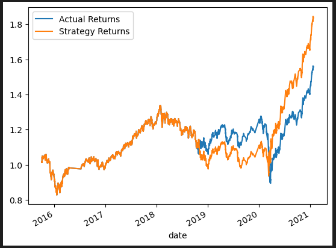

# Algorithmic_Trading_challenge14
UW FinTech course challenge14

I changed the date offset from 3 months to 6 months.

Up until 2019, the model was performing more accurately. After 2019, the model was slightly less accurate than the original.

